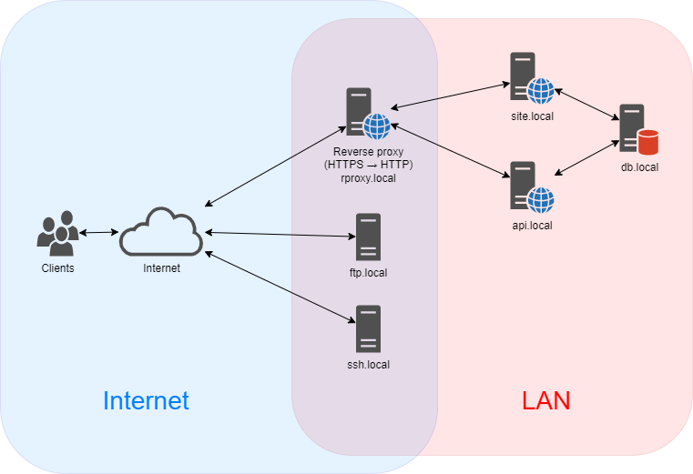
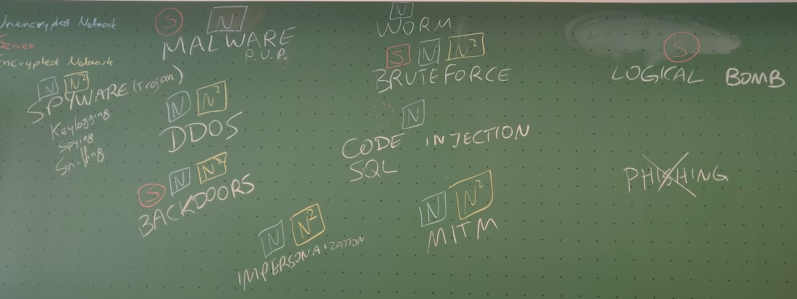

# Workshop: Intrusion Detection Systems

This repository contains a full-featured demo environment of a simple server network with a few servers, which is constantly accessed (and attacked) by automated clients.

## Description

Two networks:

* local network representing the cloud network → contains services
* virtual network representing the external network (Internet) → contains simulated clients



Running services (in internal network):

* nginx web server (SSL offloader) for :443
  * static HTML web site (simple nginx or apache2 httpd) :80
  * API (nginx) :8080
  * API (php) :9000/fcgi
* FTP server :22 with weak passwords and plain text
* SSH server with root user without password :22 (→ invisible to IDS because encrypted)
* C&C "botnet" :12345 (→ intrusion)

Simulated clients (in external network):

* several that access random parts of the website+API (https) (→ benign)
* one that tries to exploit a vulnerability (→ sql injection)
* one that accesses API directly via http (!) and not via reverse proxy (→ configuration mistake)
* one that accesses FTP (→ benign but plain text)
* one that tries to guess FTP password (→ password bruteforce)
* one that accesses SSH (→ benign) with root/. (→ invisible to IDS)
* one that accesses c&c server
* several that try DDoS

## Preparing a student machine for the training

### Install Docker

```bash
apt install ca-certificates curl gnupg lsb-release
curl -fsSL https://download.docker.com/linux/ubuntu/gpg | gpg --dearmor -o /usr/share/keyrings/docker-archive-keyring.gpg
echo \
  "deb [arch=$(dpkg --print-architecture) signed-by=/usr/share/keyrings/docker-archive-keyring.gpg] https://download.docker.com/linux/ubuntu \
  $(lsb_release -cs) stable" | tee /etc/apt/sources.list.d/docker.list > /dev/null

apt update
apt install docker-ce docker-ce-cli containerd.io

curl -L "https://github.com/docker/compose/releases/download/v2.2.3/docker-compose-$(uname -s)-$(uname -m)" -o /usr/local/bin/docker-compose
chmod +x /usr/local/bin/docker-compose
```

### Install Wireshark

```bash
apt install wireshark
# say 'Yes' to allow non-root users to use Wireshark
adduser student wireshark
```

### Install Suricata

```bash
add-apt-repository ppa:oisf/suricata-stable
apt update
apt install suricata jq
```

Copy `suricata-config/suricata.yml` to `/etc/suricata/`.  
Copy `suricata-config/rules/demo.rules` to `/etc/suricata/rules/` (move any other `.rules` files out of that folder).

### Set up IDS demo environment

Make sure that you have executed:

```bash
git submodule init
git submodule update
```

Copy the contents of `docker-idsdemo/` to `/root/idsdemo/`. Run as `root`:

```bash
cd /root/idsdemo
docker-compose up -d
```

### Set up ELK (ElasticSearch-Logstash-Kibana) (≈ GUI for Suricata)

```bash
cd /root
git pull https://github.com/deviantony/docker-elk/

cd docker-elk
./dc up -d

# once ELK stack is running (this takes a while):
./setup
```

Note: for ELK, additional configuration is necessary.
See the README file in the `docker-elk` repository.

# Training session syllabus

The training consists of 3 parts:

1. Brainstorming: what kind of attacks exist?
2. Manually finding attacks with the help of Wireshark
3. Automating the search for attacks with Suricata

## Introduction

Ask students to name any hacking attacks that they know, e.g.:
- DDoS
- sniffing
- virus
- botnet
- vulnerability exploit
- phishing
- credentials stealing/bruteforcing
- ...
Keep note of them on a blackboard.



Let students briefly brainstorm how each of them can be detected.
Keep note of this on the blackboard.

**Conclusion:** Some can be detected on the host of victim, some on the server only, some in the server network.
Some need unencrypted network traffic, some don't.

> Today we will focus on those that can be detected in the network.  
> For that we use IDS = Intrusion Detect System  
> They can be combined with e.g. a firewall or a switch that is able to block → IPS = Intrusion Protection System

## Explore with Wireshark ("≈ manual IDS")

**Goal**: detect any of the previously listed attacks using Wireshark

### Exercise 1
(guided workshop, in plenary)  
Explain how to read network communication in Wireshark (in Wireshark itself).

> Open Wireshark, select `eth0` / `enp0s0` (or similar).  
> Visit http://example.org, see it in Wireshark.

UI is divided into 5 parts:
- menu
- filter bar (we'll see soon)
- packet list
- packet contents (for selected packet)
  - select fields and see the corresponding raw bytes highlighted
- raw bytes

Important part of the menu:
- start, stop, restart
- open, save, close capture files
- to come back to main screen: stop capturing, then close capture file

Wireshark filters crash course:
- can type protocol name
  * `http` → see only http
- can filter on field values
  * `ip.src == 10.10.2.1`
  * `http.host == "site.local"`
- can use IP network masks
  * `ip.src == 10.10.0.0/16`
- can use matching
  * `http.request.uri contains ".jpg"`
- aliases:
  * `ip.addr` = `ip.src` or `ip.dst`
  * `tcp.port` = `tpc.srcport` or `tcp.dstport`

Analysis features:
- Statistics → Protocol hierarchy: see all protocols used
- Statistics → Conversations: see all hosts

Useful tricks:
- right-click a packet → Follow → TCP stream
  * note: Wireshark automatically sets filter `tcp.stream eq ###`
- can right-click any field → Prepare as a filter → Selected

### Exercise 2

> On your computer you'll find a simulated environment of a network  
> In your home folder (see Desktop) you will find a network.png, open it  
> In Wireshark, you will find two network adapters which correspond to the two networks in the graphics  
> → vnet_internal and vnet_external

Ask students to find any of the attacks on their own (prepared) machine. Let them individually experiment for 15-30 min or so.
They should keep note of them and think about how attacks can be identified automatically.

### Synthesis
(in plenary)

- What attacks have you found?
- What is the criteria that allows us to identify these attacks (i.e., what are the filters you put into Wireshark)?

## Create rules in Suricata

**Goal**: automate the previously identified criteria

Briefly explain what Suricata is and how it works:

> ≈ Wireshark + configured rules that match network packets  
> Normally IDS is located on network, and listens passively (→ explain) to the network traffic  
> This is normally done using a special switch with a so-called monitoring port, which receives a copy of the whole network traffic

### Exercise 1
(guided workshop, in plenary)

- "Suricata does not have a UI, we will work with the terminal"
- "Open terminal, become root (`sudo -s`). Your password is `student`."
- `cd /etc/suricata` and `ls`
  * `rules/` folder is where our rules live (see in a moment)
  * `suricata.yaml` configures Suricata → `less suricata.yaml` (use arrow keys, `/` to search, `q` to quit)
    - `Step 1: Inform Suricata about your network`
      Can be used in rules later to distinguish incoming and outgoing packets
    - `Step 2: Select outputs to enable`
      What output should Suricata make? By default alerts and statistics, but can also dump entire network traffic or extract sent files.
    - `Step 3: Configure common capture settings`
      Where should we listen? → select proper network interface
    - `Step 4: App Layer Protocol configuration`
      What protocols should be decoded? This makes Suricata slower, so enable only what you need.
- "No need to make changes, they have been done already for you"
- `cd rules` and `ls` → see only suricata.rules
- `nano suricata.rules` → see a dummy rule

Rule format: `ACTION PROTOCOL SRC SRCPORT -> DST DSTPORT ( OPTIONS )`  
→ https://suricata.readthedocs.io/en/suricata-6.0.5/rules/intro.html

- ACTION is `alert` (99% of cases) or `pass` (to flag something as good; but caution!); can also be `drop` in IPS mode.
- PROTOCOL is `ip` (= any), `tcp`, or a higher level protocol (enabled in suricata.yaml!) such as `http`, `tls`, `smb`...
- SRC and DST can be `any` or `$HOME_NET` or `10.10.0.0/16`. Can use negation `!` and grouping `[xxx, xxx, xxx]`.
- SRCPORT and DSTPORT can be `any` or `80` or `6500:6599`. Can use negation `!` and grouping `[xxx, xxx, xxx]`.
- direction can be specified using `->` (unidirectional) or `<>` (bidirectional).
- OPTIONS are of the form `keyword: value;`

Some options should always be there (best practises):  
→ https://suricata.readthedocs.io/en/suricata-6.0.5/rules/meta.html

- `msg:"xxx"` the alert message
- `classtype:xxx` the alert category (see `classification.conf` in Suricata configuration directory)
- `sid:12345` the rule ID
- `rev:1` version number of the rule

By convention, `msg` should be the first keyword and `classtype`, `sid`, `rev` the last ones.

Options are processed one after the other (order matters!).  
→ https://suricata.readthedocs.io/en/suricata-6.0.0/rules/index.html

Explain content modifiers & sticky buffers with the help of examples (see https://suricata.readthedocs.io/en/suricata-6.0.0/rules/intro.html#modifier-keywords)

Show how to detect these features by writing corresponding rules (joint exercise):
  * unusual ports from unusual networks
  * (IP reputation, geoip)
  * general plaintext
    - https://suricata.readthedocs.io/en/suricata-6.0.0/rules/payload-keywords.html
  * plaintext in module variables (e.g. [http](https://suricata.readthedocs.io/en/suricata-6.0.0/rules/http-keywords.html), dns)
  * threshold (→ DDoS)
    - https://medium.com/@mshulkhan/detection-attack-using-suricata-1-5ea7b2f62551

Reload rules using
```bash
suricatasc -c reload-rules
# or
systemctl restart suricata
```

If you get `No such file or directory` for the former, you might need to open `/etc/suricata/suricata.yaml` and edit the following (search for `.socket` with Ctrl+W) to match the real path to the Suricata command socket:
```bash
unix-command:
  enabled: yes
  filename: /var/run/suricata/suricata-command.socket
```

Examples:

```
alert ip !$HOME_NET any -> any ![80,443] (msg:"Unusual ports";)
alert tcp any any -> any any (msg:"Adult content"; content:"porn";)
alert tcp any any -> any any (msg:"Adult content"; content:"porn"; nocase;)
# "sex" is bad, but "wirtschaftsexperte" is ok
alert tcp any any -> any any (msg:"Adult content"; content:"sex"; nocase; content:!"perte"; nocase; distance:0; within:5;)
alert http any any -> any any (msg:"Unusual user agent"; http.user_agent; content:!"Mozilla/"; startswith;)
alert ip any any -> any any (msg:"New client"; threshold: type limit, track by_src, seconds 3600, count 1;)
alert tcp any any -> any any (msg:"DDoS"; threshold: type threshold, track by_dst, count 100, seconds 60;)
```

### Exercise 2

Let students experiment on their own and write rules to detect (raise alert) the previously identified attacks.
Go around the class and help the students.

For help, do one of the exercices in class.

### Exercise 3
(guided workshop, in plenary)

> Up until now, alerts are logged in a local log file. How can they be visualized?

- log format is JSON-based → use `jq`
- use with GUI: Kibana

## Further topics

- malware rule set: EMET - https://rules.emergingthreatspro.com/OPEN_download_instructions.html
- rule naming convention

## Takeaways

Ask students if they can think of any issues/limitations when using an IDS:

* the purpose of an IDS is *not* to replace security; it is an additional security measure!
 (detection ≠ prevention)
* IDS should be *passive* – otherwise it can become a bottleneck!
 (attacks against IDS exist)
* IDS cannot read encrypted data – need to put it behind an SSL offloader

---

## Resources

* Suricata documentation
  https://suricata.readthedocs.io/
* Presentation on some Suricata techniques
  https://resources.sei.cmu.edu/asset_files/presentation/2016_017_001_449890.pdf
* Workshop with exercices
  https://nsrc.org/workshops/2015/pacnog17-ws/raw-attachment/wiki/
* How-to Suricata with ELK
  https://www.howtoforge.com/tutorial/suricata-with-elk-and-web-front-ends-on-ubuntu-bionic-beaver-1804-lts/
* How-to Simple DDoS detection with Suricata
  https://medium.com/@mshulkhan/detection-attack-using-suricata-1-5ea7b2f62551
